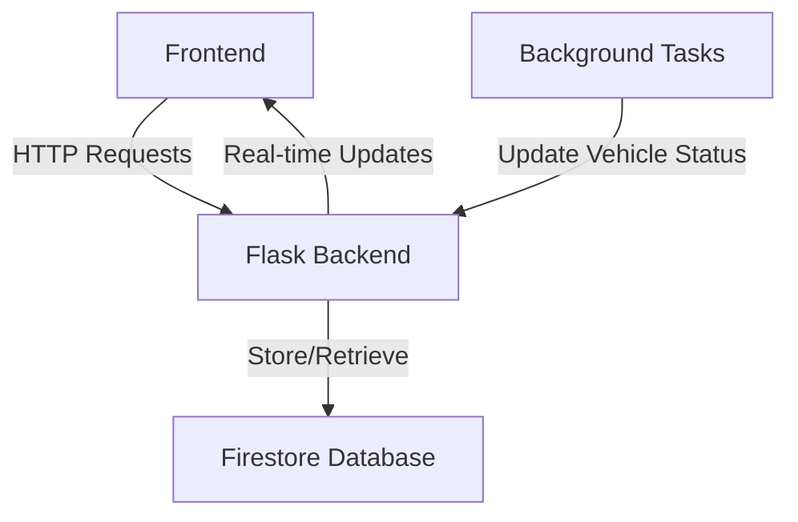
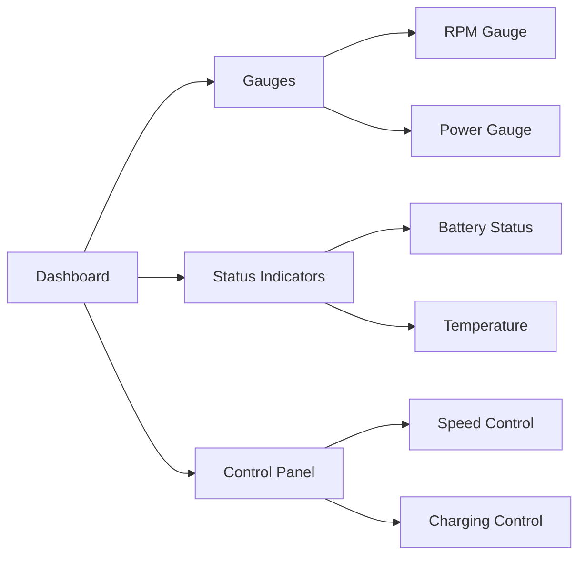
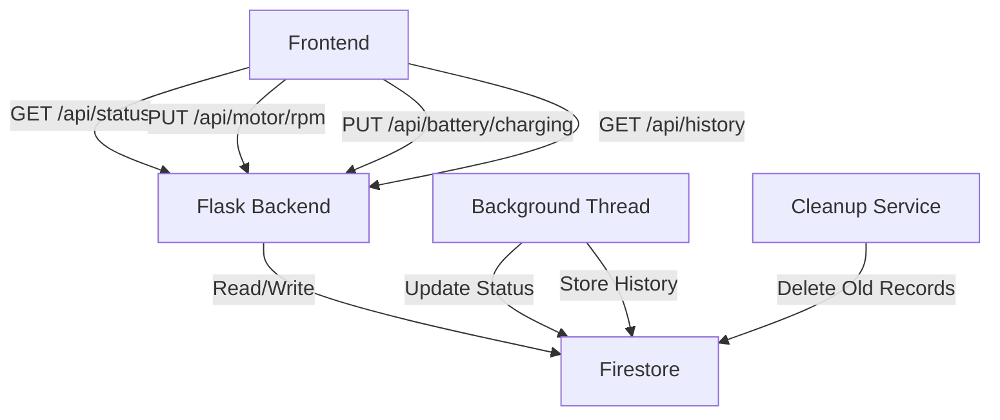

# Vehicle Dashboard Simulator

## Overview
A real-time vehicle dashboard simulator that emulates key vehicle metrics including motor RPM, power consumption, battery status, and temperature. Built with Python (Flask) backend and vanilla JavaScript frontend.


## Features

| Feature | Description | Status |
|---------|------------|---------|
| Real-time Gauges | Dynamic RPM and Power gauges | ✅ |
| Battery Monitoring | Battery percentage and charging status | ✅ |
| Temperature Tracking | Real-time temperature monitoring | ✅ |
| Historical Data | Data logging and visualization | ✅ |
| Charging Simulation | Simulated charging mechanics | ✅ |

## System Architecture




## Technical Stack

| Component | Technology |
|-----------|------------|
| Frontend | HTML, CSS, JavaScript, D3.js |
| Backend | Python, Flask |
| Database | Google Firestore |
| Deployment | Vercel (Backend), GitHub Pages (Frontend) |

## Key Components

### Backend Services
- Vehicle status management
- Real-time data updates
- Historical data logging
- Battery simulation
- Temperature modeling

### Frontend Features




# API Documentation

## API Endpoints and Their Interactions

| Endpoint | Method | Description | Request Body | Response | Connected Services | Related Functions |
|----------|---------|-------------|--------------|-----------|-------------------|------------------|
| `/test` | GET | Basic server health check | None | ```json { "message": "Server is running!", "status": "OK" }``` | None | None |
| `/api/test` | GET | Database connection test | None | ```json { "message": "Database connection successful", "data_exists": true }``` | Firestore | None |
| `/api/status` | GET | Get current vehicle status | None | ```json { "motor": {...}, "battery": {...}, "indicators": {...} }``` | Firestore | - `updateDashboard()` (Frontend)<br>- `fetchVehicleStatus()` (Frontend) |
| `/api/motor/rpm` | PUT | Update motor RPM | ```json { "rpm": number }``` | ```json { "success": true, "new_rpm": number }``` | Firestore | - `calculate_power_consumption()`<br>- Background thread updates |
| `/api/battery/charging` | PUT | Toggle charging state | ```json { "isCharging": boolean }``` | ```json { "success": true, "isCharging": boolean }``` | Firestore | - Background thread updates<br>- Motor RPM reset |
| `/api/history` | GET | Fetch historical data | None | ```json [{ "timestamp": {...}, "rpm": number, ... }]``` | Firestore | - `store_historical_data()`<br>- `cleanup_old_data()` |
| `/api/cleanup` | POST | Remove old records | None | ```json { "message": "Deleted X old records" }``` | Firestore | `cleanup_old_data()` |

## Background Services

| Service | Interval | Description | Connected APIs | Database Operations |
|---------|----------|-------------|----------------|-------------------|
| `update_battery_status()` | 1s | Updates battery percentage, temperature, and power consumption | None | - Read vehicle status<br>- Update vehicle status |
| `store_historical_data()` | 3s | Logs vehicle metrics | None | - Write to vehicleHistory collection |
| Frontend Status Update | 1s | Polls current vehicle status | `/api/status` | None |

## Data Flow Diagram


json
{
"motor": {
"rpm": 0,
"powerConsumption": 0,
"gearRatio": "3:1",
"isActive": false
},
"battery": {
"percentage": 100,
"temperature": 25,
"isCharging": false,
"lowBatteryThreshold": 20
},
"indicators": {
"parkingBrake": false,
"checkEngine": false,
"motorActive": false,
"batteryLow": false
}
}

## Setup and Installation

### Prerequisites
- Python 3.8+
- Node.js (for local development)
- Google Cloud account with Firestore enabled


## Simulation Parameters

| Parameter | Value | Description |
|-----------|-------|------------|
| Battery Drain Rate | 0.1%/s | When motor is running |
| Charging Rate | 0.2%/s | When charging |
| Temperature Increase | 0.1°C/s | When motor is running |
| Temperature Decrease | 0.05°C/s | When motor is off |
| Max RPM | 800 | Maximum motor speed |
| Update Interval | 1000ms | Status refresh rate |

## Performance Considerations

- Real-time updates limited to 1-second intervals
- Historical data stored every 3 seconds
- Automatic cleanup of data older than 24 hours
- Rate limiting implemented for API calls


Visit [kritupatel.com/vehicleDashboard](https://kritupatel.com/vehicleDashboard)

⚠️ **Important Note**: 
- The backend is hosted on Render's free tier which spins down after 15 minutes of inactivity
- Initial requests may take 30-60 seconds while the server spins up
- Subsequent requests will work normally once the server is running

### Expected Behavior
1. The dashboard will display two gauges:
   - RPM Gauge (0-800 RPM)
   - Power Consumption Gauge (-1000 to 1000 kW)
2. Status indicators show:
   - Battery percentage
   - Temperature
   - Motor status
   - Charging status
3. Controls available:
   - Speed control slider (0-4 settings)
   - Charging toggle
   - History view
  


# Local Setup Instructions

1. Clone the repository
   ```bash
   git clone https://github.com/kritup/VehicleDashboard.git
   cd VehicleDashboard
   ```

2. Set up Firebase
   - Go to Firebase Console (https://console.firebase.google.com/)
   - Create a new project or select existing project
   - Go to Project Settings > Service Accounts
   - Click "Generate New Private Key"
   - Create a folder named 'database' in project root
   - Save the downloaded JSON file in the 'database' folder
   - Rename the file to: `vehicledashboardproject-firebase-adminsdk.json`

3. Create and activate Python virtual environment
   ```bash
   # For macOS/Linux
   python3 -m venv venv
   source venv/bin/activate

   # For Windows
   python -m venv venv
   .\venv\Scripts\activate
   ```

4. Install required packages
   ```bash
   pip install -r requirements.txt
   ```

5. Start the backend server
   ```bash
   python api/index.py
   ```
   Server will start on http://localhost:5001

6. Open the frontend
   - Simply open `index.html` in your web browser
   OR
   - Start a local server:
     ```bash
     python -m http.server 3000
     ```
   - Navigate to http://localhost:3000 in your browser

The application should now be running locally with:
- Backend at http://localhost:5001
- Frontend at http://localhost:3000 (if using local server)

To verify everything is working:
- Check browser console for any errors
- Visit http://localhost:5001/test to verify backend is running
- Visit http://localhost:5001/api/test to verify database connection

### Troubleshooting
- If gauges don't update, check the browser console for connection errors
- Ensure your browser supports JavaScript and WebSocket connections
- Clear browser cache if you experience display issues
- For local setup, ensure ports 5001 (backend) and 3000 (frontend) are available


## Contributing

1. Fork the repository
2. Create your feature branch (`git checkout -b feature/AmazingFeature`)
3. Commit your changes (`git commit -m 'Add some AmazingFeature'`)
4. Push to the branch (`git push origin feature/AmazingFeature`)
5. Open a Pull Request

## License

This project is licensed under the MIT License - see the [LICENSE.md](LICENSE.md) file for details

## Acknowledgments

- D3.js for gauge visualizations
- Google Firebase for real-time database
- Flask for backend API
