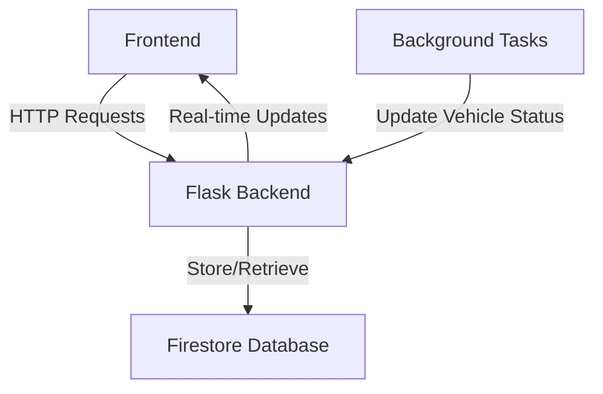
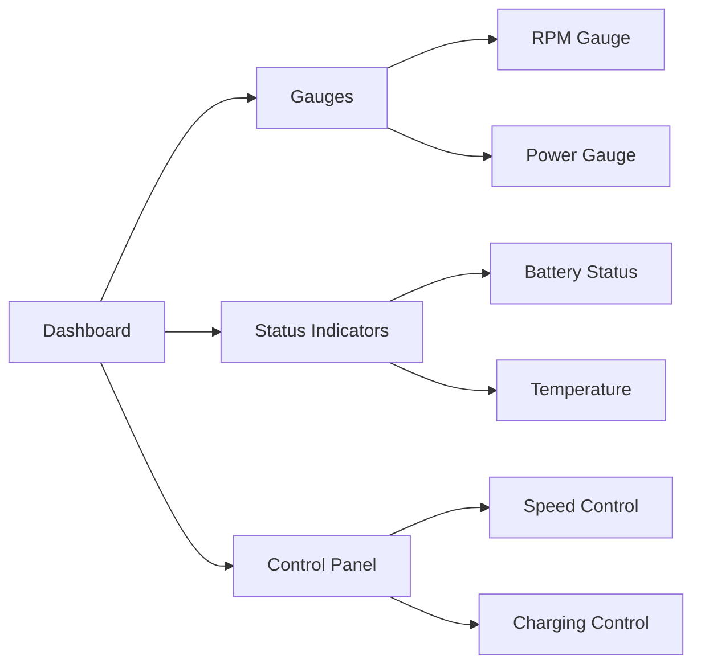

# Vehicle Dashboard Simulator

## Overview
A real-time vehicle dashboard simulator that emulates key vehicle metrics including motor RPM, power consumption, battery status, and temperature. Built with Python (Flask) backend and vanilla JavaScript frontend.

## Features

| Feature | Description | Status |
|---------|------------|---------|
| Real-time Gauges | Dynamic RPM and Power gauges | ✅ |
| Battery Monitoring | Battery percentage and charging status | ✅ |
| Temperature Tracking | Real-time temperature monitoring | ✅ |
| Historical Data | Data logging and visualization | ✅ |
| Charging Simulation | Simulated charging mechanics | ✅ |

## System Architecture

## Technical Stack

| Component | Technology |
|-----------|------------|
| Frontend | HTML, CSS, JavaScript, D3.js |
| Backend | Python, Flask |
| Database | Google Firestore |
| Deployment | Vercel (Backend), GitHub Pages (Frontend) |

## Key Components

### Backend Services
- Vehicle status management
- Real-time data updates
- Historical data logging
- Battery simulation
- Temperature modeling

### Frontend Features

## Setup and Installation

### Prerequisites
- Python 3.8+
- Node.js (for local development)
- Google Cloud account with Firestore enabled

## Simulation Parameters

| Parameter | Value | Description |
|-----------|-------|------------|
| Battery Drain Rate | 0.1%/s | When motor is running |
| Charging Rate | 0.2%/s | When charging |
| Temperature Increase | 0.1°C/s | When motor is running |
| Temperature Decrease | 0.05°C/s | When motor is off |
| Max RPM | 800 | Maximum motor speed |
| Update Interval | 1000ms | Status refresh rate |

## Performance Considerations

- Real-time updates limited to 1-second intervals
- Historical data stored every 3 seconds
- Automatic cleanup of data older than 24 hours
- Rate limiting implemented for API calls

## Browser Compatibility

| Browser | Supported Versions |
|---------|-------------------|
| Chrome | 60+ |
| Firefox | 60+ |
| Safari | 12+ |
| Edge | 79+ |

Visit [kritupatel.com/vehicleDashboard](https://kritupatel.com/vehicleDashboard)

⚠️ **Important Note**: 
- The backend is hosted on Render's free tier which spins down after 15 minutes of inactivity
- Initial requests may take 30-60 seconds while the server spins up
- Subsequent requests will work normally once the server is running

### Expected Behavior
1. The dashboard will display two gauges:
   - RPM Gauge (0-800 RPM)
   - Power Consumption Gauge (-1000 to 1000 kW)
2. Status indicators show:
   - Battery percentage
   - Temperature
   - Motor status
   - Charging status
3. Controls available:
   - Speed control slider (0-4 settings)
   - Charging toggle
   - History view

### Troubleshooting
- If gauges don't update, check the browser console for connection errors
- Ensure your browser supports JavaScript and WebSocket connections
- Clear browser cache if you experience display issues
- For local setup, ensure ports 5001 (backend) and 3000 (frontend) are available

## Contributing

1. Fork the repository
2. Create your feature branch (`git checkout -b feature/AmazingFeature`)
3. Commit your changes (`git commit -m 'Add some AmazingFeature'`)
4. Push to the branch (`git push origin feature/AmazingFeature`)
5. Open a Pull Request

## License

This project is licensed under the MIT License - see the [LICENSE.md](LICENSE.md) file for details

## Acknowledgments

- D3.js for gauge visualizations
- Google Firebase for real-time database
- Flask for backend API
